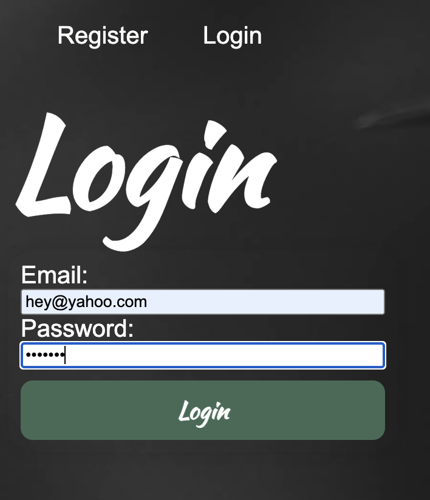
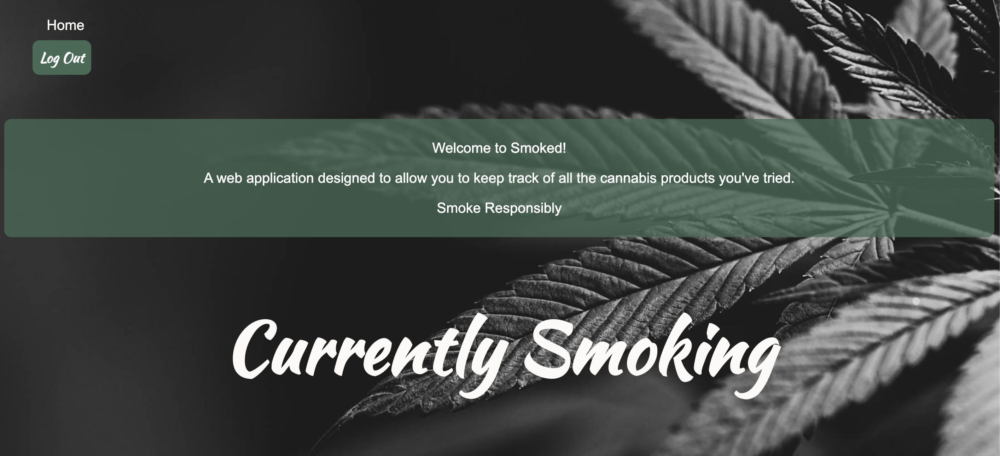
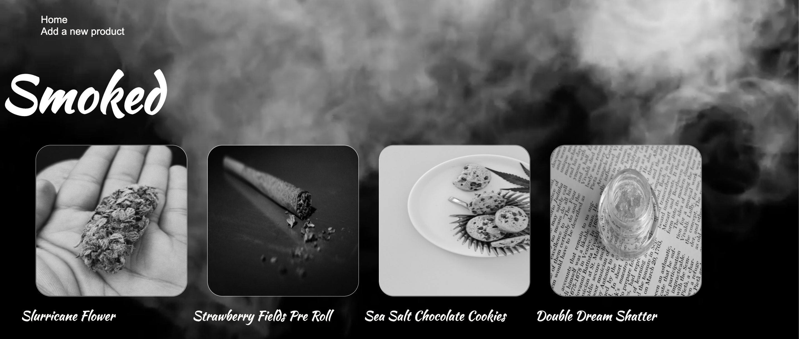
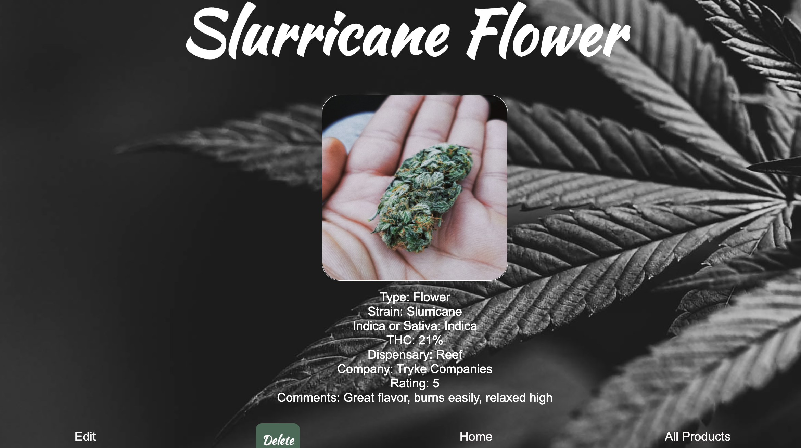
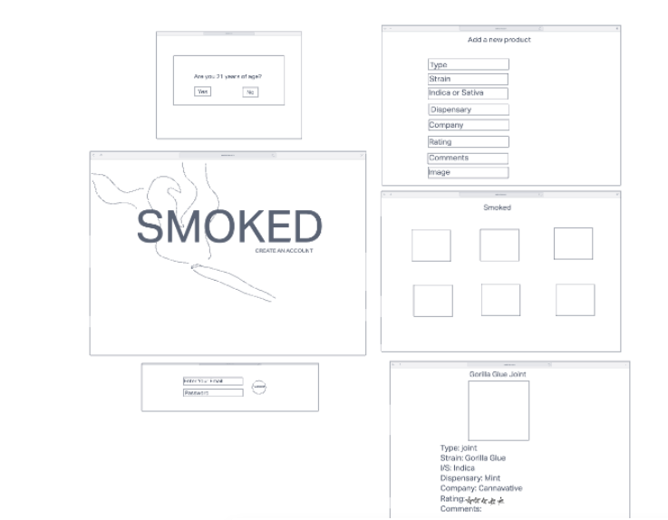

# SMOKED

#### A full-stack web application for cannabis users to keep track of products they have tried

## Description
User can create an account if 21 years of age. Then add cannabis products they've tried with a whole slew of information.

## Table of Contents

* [Technologies Used](#technologiesused)
* [Features](#features)
* [Design](#design)
* [Project Next Steps](#nextsteps)
* [Deployed App](#deployment)

## Technologies Used
* HTML5
* CSS3
* JavaScript
* Express
* MongoDB
* Mongoose
* Google Fonts

## Features
Users can create an account and upload pictures and information about cannabis products they have used.

## Wireframe

## Trello Planning
https://trello.com/b/tOfSpl29/smoked

## Design
Design elements implemented using HTML5, CSS3, and google fonts

## Project Next Steps
* Allow users to customize their profile
* Allow users to follow friends
* Allow users to comment on friends posts
* Change Sativa/Indica to terpene profiles
* Add nearby events
* Show top products
* Show dispensaries nearby

## <a name="deployment" src="https://smoked-application.herokuapp.com/">Smoked Deployment Link</a>

* You can view the repository:
https://github.com/ldukles/smoked_

## Works Cited:
http://pexels.com
background video of home page

https://unsplash.com
For all the great quality cannabis photos

https://blog.hubspot.com/website/video-background-css
for learning how to implement mp4 videos as a background

http://imgur.com
photo upload and ease of accessibility

https://www.w3schools.com/jsref/met_win_confirm.asp
adding age verification pop-up